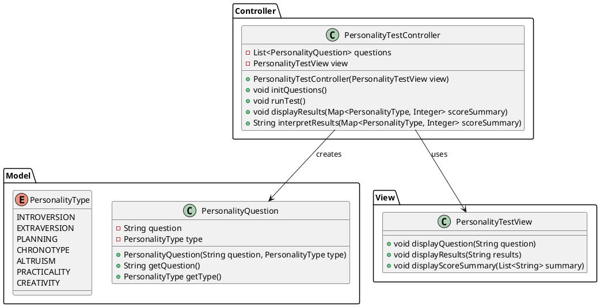
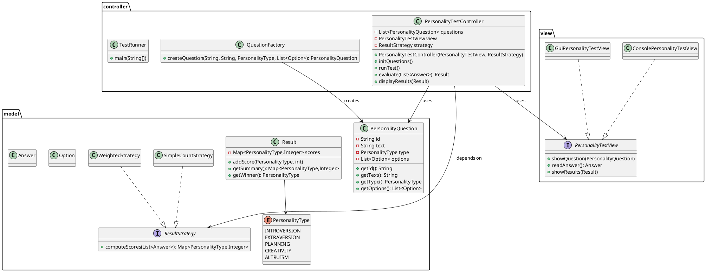

1er essaie

deuxieme essaie 
1. Vue d'ensemble
L'application suit l'architecture MVC :
- model : données et logique métier
- view : interface utilisateur (console / GUI)
- controller : orchestration, injection de dépendances

Principes SOLID : application concrète

- SRP (Single Responsibility)
  - PersonalityQuestion : conteneur de données et uniquement d’accès aux données.
  - Result / ResultStrategy : responsabilité unique de calcul et d’interprétation des scores.
  - PersonalityTestController : orchestration (récupère les réponses, appelle la stratégie, demande à la vue d’afficher).

- OCP (Open/Closed)
  - Nouvelles stratégies de calcul (nouvelle classe implémentant ResultStrategy) s’ajoutent sans modifier le contrôleur.
  - Nouvelles vues (ex. GUI) implémentent PersonalityTestView et se branchent sans toucher au reste.

- LSP (Liskov Substitution)
  - Toute vue implémentant PersonalityTestView peut remplacer la vue actuelle sans changer le comportement attendu.
  - Toute implémentation de ResultStrategy respecte le contrat computeScores().

- ISP (Interface Segregation)
  - PersonalityTestView propose uniquement les méthodes nécessaires à l’UI. Les vues spécifiques ajoutent leurs propres méthodes si besoin.

- DIP (Dependency Inversion)
  - Le contrôleur dépend d’abstractions (PersonalityTestView, ResultStrategy) et non d’implémentations concrètes. Les dépendances sont injectées (constructeur ou injection DI).

Exemples concrets dans le code :
- PersonalityTestController(PersonalityTestView view, ResultStrategy strategy)
- QuestionFactory.createQuestion(...) : création isolée

---

Design Patterns implémentés et justification

1. Factory (QuestionFactory)
   - Pourquoi : centraliser la création d’objets Question (complexes : options, poids, id). Facilite tests et modifications de la création.
   - Où : QuestionFactory.createQuestion(...)

2. Strategy (ResultStrategy + implémentations SimpleCountStrategy, WeightedStrategy)
   - Pourquoi : différentes logiques d’interprétation des réponses (comptage simple vs. pondéré) doivent être interchangeables sans modifier le contrôleur.
   - Où : injecté dans PersonalityTestController ; méthode computeScores(answers)

Évolutions possibles :
- Observer : pour notifier UI lorsque la progression change (utile pour GUI).
- Command : pour enregistrer actions de l’utilisateur et supporter annulation/replay.


3ème essai et dernier : 
# Rapport Technique - Projet de Test de Personnalité
Ce document détaille l'architecture, les choix de conception et la méthodologie de développement pour le projet de test de personnalité. Il inclut également une section sur la méthodologie de travail, le processus de transition depuis un projet initial de concession automobile, et l'usage de l'Intelligence Artificielle.
---
## 1. Architecture du Projet
L'application de test de personnalité est conçue en suivant une architecture **Modèle-Vue-Contrôleur (MVC)** claire et structurée. Elle adhère aux principes de conception **SOLID** pour garantir la maintenabilité, l'extensibilité et la robustesse du code.


### Diagramme de Classes UML (PlantUML)

```plantuml
@startuml
!pragma layout smetana ' Algorithme de layout pour des diagrammes plus esthétiques
skinparam defaultFontName "Arial"
skinparam defaultFontSize 12
skinparam class {
    BorderColor Black
    BackgroundColor White
    ArrowColor Black
}
skinparam interface {
    BorderColor DarkBlue
    BackgroundColor LightGray
    ArrowColor DarkBlue
}
skinparam enum {
    BorderColor DarkGreen
    BackgroundColor LightGreen
    ArrowColor DarkGreen
}
' Package principal de l'application

package "Application Entry Point" <<Folder>> as appEntryPoint {
    class Main {
        + {static} main(args: String[]): void
    }
}
' Package du Contrôleur

package "Controller Layer" <<Rectangle>> as controller {
    class PersonalityTestController {
        - questions: List<PersonalityQuestion> = new ArrayList<>()
        - view: PersonalityTestView
        - strategy: ResultStrategy
        + PersonalityTestController(PersonalityTestView view, ResultStrategy strategy)
        + runTest(): void
        - loadQuestions(): void
        - evaluate(answers: List<Answer>): Result
        - displayResults(result: Result): void
        + getQuestions(): List<PersonalityQuestion>
    }
}

' Package de la Vue
package "View Layer" <<Rectangle>> as view {
    interface PersonalityTestView {
        + showQuestion(question: PersonalityQuestion): void
        + readAnswer(): Answer
        + showResults(result: Result): void
    }
    class ConsolePersonalityTestView {
        - scanner: Scanner
        - lastQuestion: PersonalityQuestion
        + showQuestion(question: PersonalityQuestion): void
        + readAnswer(): Answer
        + showResults(result: Result): void
        - getDescriptionForPersonalityType(type: PersonalityType): String
    }
    class GuiPersonalityTestView {
        + showQuestion(question: PersonalityQuestion): void
        + readAnswer(): Answer
        + showResults(result: Result): void
    }
}

' Package Factory

package "Factory" <<Rectangle>> as factory {
    class QuestionFactory {
        + {static} createQuestion(id: String, text: String, type: PersonalityType, options: List<Option>): PersonalityQuestion
        + {static} defaultOptionsFor(primary: PersonalityType, secondary: PersonalityType): List<Option>
    }
}

' Package du Modèle (Données & Logique Métier)
package "Model Layer" <<Rectangle>> as model {
    class Answer {
        - questionId: String
        - selectedOption: Option
        + Answer(questionId: String, selectedOption: Option)
        + getQuestionId(): String
        + getSelectedOption(): Option
    }
    class Option {
        - id: String
        - text: String
        - type: PersonalityType
        - score: int
        + Option(id: String, text: String, type: PersonalityType, score: int)
        + getId(): String
        + getText(): String
        + getType(): PersonalityType
        + getScore(): int
        + toString(): String
        + toDetailedString(): String
    }
    class PersonalityQuestion {
        - id: String
        - text: String
        - type: PersonalityType
        - options: List<Option>
        + PersonalityQuestion(id: String, text: String, type: PersonalityType, options: List<Option>)
        + getId(): String
        + getText(): String
        + getType(): PersonalityType
        + getOptions(): List<Option>
    }
    enum PersonalityType {
        INTROVERSION,
        EXTRAVERSION,
        PLANNING,
        CREATIVITY,
        ALTRUISM
    }
    class Result {
        - scores: Map<PersonalityType, Integer> = new EnumMap<>(PersonalityType.class)
        + Result()
        + addScore(type: PersonalityType, value: int): void
        + getSummary(): Map<PersonalityType, Integer>
        + getWinner(): PersonalityType
        + toString(): String
    }
    interface ResultStrategy {
        + computeScores(answers: List<Answer>): Map<PersonalityType, Integer>
    }
    class SimpleCountStrategy {
        + computeScores(answers: List<Answer>): Map<PersonalityType, Integer>
    }
    class WeightedStrategy {
        + computeScores(answers: List<Answer>): Map<PersonalityType, Integer>
    }
}

' Relations d'implémentation (interfaces et classes)
model.ResultStrategy <|.. model.SimpleCountStrategy : "implémente"
model.ResultStrategy <|.. model.WeightedStrategy : "implémente"
view.PersonalityTestView <|.. view.ConsolePersonalityTestView : "implémente"
view.PersonalityTestView <|.. view.GuiPersonalityTestView : "implémente"

' Relations du point d'entrée (Main)
Main .up.> controller.PersonalityTestController : "crée et utilise"
Main .left.> view.ConsolePersonalityTestView : "crée"
Main .down.> model.SimpleCountStrategy : "crée (si simple)"
Main .down.> model.WeightedStrategy : "crée (si weighted)"

' Relations du Contrôleur
controller.PersonalityTestController o-- view.PersonalityTestView : "collabore avec la"
controller.PersonalityTestController o-- model.ResultStrategy : "utilise la"
controller.PersonalityTestController ..> factory.QuestionFactory : "utilise la factory"
controller.PersonalityTestController ..> model.PersonalityQuestion : "gère les"
controller.PersonalityTestController ..> model.Answer : "reçoit des"
controller.PersonalityTestController ..> model.Result : "crée et traite les"
controller.PersonalityTestController ..> model.PersonalityType : "utilise"

' Relations du Modèle (entre ses propres classes)
model.PersonalityQuestion "1" *-- "many" model.Option : "possède des"
model.Option "1" *-- "1" model.PersonalityType : "est de type"
model.PersonalityQuestion "1" *-- "1" model.PersonalityType : "concerne le type"
model.Answer "1" *-- "1" model.Option : "contient une"
model.Result "1" *-- "many" model.PersonalityType : "agrège les scores par"

' Relations de la Factory
factory.QuestionFactory ..> model.PersonalityQuestion : "crée des"
factory.QuestionFactory ..> model.Option : "crée des"
factory.QuestionFactory ..> model.PersonalityType : "utilise"

' Relations des Vues

' L'interface View dépend des classes du modèle pour ses arguments/retours
view.PersonalityTestView .up.> model.PersonalityQuestion : "affiche"
view.PersonalityTestView .left.> model.Answer : "retourne"
view.PersonalityTestView .right.> model.Result : "affiche"
' ConsolePersonalityTestView dépend de classes du modèle pour l'interaction
view.ConsolePersonalityTestView ..> model.PersonalityQuestion : "manipule"
view.ConsolePersonalityTestView ..> model.Option : "manipule"
view.ConsolePersonalityTestView ..> model.Answer : "crée"
view.ConsolePersonalityTestView ..> model.Result : "affiche"
view.ConsolePersonalityTestView ..> model.PersonalityType : "utilise pour desc."
view.ConsolePersonalityTestView ..> java.util.Scanner : "utilise"
' GuiPersonalityTestView dépend de classes du modèle pour l'interaction (éventuellement)
view.GuiPersonalityTestView ..> model.PersonalityQuestion : "manipule"
view.GuiPersonalityTestView ..> model.Answer : "crée"
view.GuiPersonalityTestView ..> model.Result : "affiche"

' Relations des stratégies de résultat
model.ResultStrategy ..> model.Answer : "traite les"
model.ResultStrategy ..> model.PersonalityType : "utilise pour scorer"
model.SimpleCountStrategy ..> model.Option : "accède aux"
model.WeightedStrategy ..> model.Option : "accède aux"
' Pour aider le layout à mieux placer les éléments
Main -[hidden]right- controller
controller -[hidden]right- view
view -[hidden]right- factory
factory -[hidden]right- model
@enduml

```



### Explication des Composants (MVC)
L'architecture MVC divise l'application en trois composants principaux, facilitant la séparation des préoccupations :
*   **Modèle (`projet.model`) :**
    *   Ce package regroupe l'ensemble des données de l'application et la logique métier associée. Il est indépendant de l'interface utilisateur.
    *   Les classes telles que `PersonalityQuestion`, `Option`, `Answer`, et l'énumération `PersonalityType` définissent les structures de données fondamentales du test.
    *   Les interfaces et implémentations `ResultStrategy` (`SimpleCountStrategy`, `WeightedStrategy`) encapsulent les différentes méthodes de calcul des résultats du test, illustrant l'application du pattern Stratégie.
*   **Vue (`projet.view`) :**
    *   La vue est responsable de l'affichage des informations à l'utilisateur et de la collecte de ses entrées. Elle est conçue pour être la plus passive possible.
    *   L'interface `PersonalityTestView` établit un contrat pour toute implémentation de vue.
    *   `ConsolePersonalityTestView` est l'implémentation actuelle, gérant les interactions via la console. `GuiPersonalityTestView` est prévue comme une extension future pour une interface graphique.
*   **Contrôleur (`projet.controller`) :**
    *   Le contrôleur agit comme l'intermédiaire entre la vue et le modèle. Il interprète les entrées utilisateur de la vue, les traduit en actions pour le modèle, et met à jour la vue en conséquence.
    *   `PersonalityTestController` orchestre le déroulement du test, gère les réponses et déclenche le calcul des résultats.
    *   Le sous-package `projet.controller.factory` contient `QuestionFactory`, une classe dédiée à la création des questions, ce qui maintient le contrôleur propre et respecte le principe de responsabilité unique.
    *   `TestRunner` est une classe située également dans ce package, utilisée pour lancer des scénarios de test ou des exécutions spécifiques de l'application.
*   **Points d'entrée (`projet`) :**
    *   La classe `Main.java` est le point d'entrée principal de l'application, responsable de l'initialisation des composants MVC et du lancement du test.
---
## 2. Design Patterns et Principes SOLID
## 2. Design Patterns
Cette section décrit les principaux Design Patterns GoF (Gang of Four) ou autres qui ont été appliqués dans l'architecture, en justifiant leur choix.
*   **Strategy Pattern (Comportemental) :**
    *   **Application :** Implémenté via l'interface `ResultStrategy` (avec `SimpleCountStrategy` et `WeightedStrategy` comme implémentations concrètes).
    *   **Justification :** Permet de définir une famille d'algorithmes (calcul des scores du test de personnalité), de les encapsuler, et de les rendre interchangeables. Cela rend l'application flexible, permettant d'ajouter de nouvelles méthodes de calcul des résultats sans modifier le code du contrôleur (`PersonalityTestController`). Le contrôleur dépend de l'interface `ResultStrategy`, respectant ainsi le Principe Ouvert/Fermé (Open/Closed Principle) de SOLID.
*   **Factory Method Pattern (Créationnel) :**
    *   **Application :** La classe `QuestionFactory` est responsable de la création des objets `PersonalityQuestion` et `Option`.
    *   **Justification :** Centralise la logique de création d'objets complexes. Les `PersonalityQuestion` avec leurs `Option` associées peuvent avoir des configurations spécifiques. La Factory permet de masquer cette complexité de création au reste de l'application (notamment au contrôleur), garantissant que les objets sont correctement initialisés et facilitant l'évolution des mécanismes de création.
*   **Model-View-Controller (MVC) (Architectural) :**
    *   **Application :** L'ensemble de l'architecture est structuré autour des packages `model`, `view`, et `controller`.
        *   `model` : Contient la logique métier et les données (`PersonalityQuestion`, `Option`, `Result`, `PersonalityType`, `ResultStrategy` et ses implémentations).
        *   `view` : Gère l'affichage et les interactions utilisateur (`PersonalityTestView`, `ConsolePersonalityTestView`, `GuiPersonalityTestView`).
        *   `controller` : Fait le lien entre le Modèle et la Vue, gère le flux du programme (`PersonalityTestController`).
    *   **Justification :** Assure une séparation claire des préoccupations, ce qui améliore la maintenabilité, la testabilité et la modularité de l'application. Changer l'interface utilisateur (passer de la console au graphique) n'impacte pas la logique métier, et vice-versa.
---
## 2.1 Principes SOLID
En plus des Design Patterns spécifiques, l'ensemble de l'architecture a été guidé par les principes **SOLID**, un acronyme représentant cinq principes de conception qui visent à rendre le logiciel plus compréhensible, flexible et maintenable.
*   **S - Single Responsibility Principle (Principe de Responsabilité Unique) :**
    *   **Description :** Une classe ne devrait avoir qu'une seule raison de changer. Autrement dit, elle ne devrait avoir qu'une seule responsabilité.
    *   **Application dans le projet :**
        *   `PersonalityTestController` : Sa seule responsabilité est d'orchestrer le flux du test (charger les questions, recueillir les réponses, lancer le calcul des résultats, afficher les résultats).
        *   `PersonalityQuestion` : Sa seule responsabilité est de contenir les données d'une question.
        *   `QuestionFactory` : Sa seule responsabilité est de créer des instances de `PersonalityQuestion` et `Option` de manière encapsulée.
        *   `Result` : Sa seule responsabilité est d'agréger et de gérer les scores du test.
    *   **Bénéfice :** Facilite la maintenance et réduit le risque d'introduire des bugs. Si, par exemple, la logique d'affichage change, seules les classes `View` sont affectées, pas le `Controller` ou le `Model`.
*   **O - Open/Closed Principle (Principe Ouvert/Fermé) :**
    *   **Description :** Les entités logicielles (classes, modules, fonctions, etc.) doivent être ouvertes à l'extension, mais fermées à la modification. Cela signifie que l'on doit pouvoir ajouter de nouvelles fonctionnalités sans changer le code existant.
    *   **Application dans le projet :**
        *   `ResultStrategy` : L'interface permet d'ajouter de nouvelles stratégies de calcul des scores (ex: une `AdvancedStrategy`) sans modifier le `PersonalityTestController`. Le contrôleur travaille avec l'interface `ResultStrategy` et n'a pas besoin de connaître les implémentations concrètes.
        *   `PersonalityTestView` : L'interface permet d'ajouter de nouvelles vues (ex: `GuiPersonalityTestView`) sans modifier le `PersonalityTestController`.
    *   **Bénéfice :** Rend l'architecture flexible et extensible, facilitant l'ajout de nouvelles fonctionnalités sans casser celles existantes.
*   **L - Liskov Substitution Principle (Principe de Substitution de Liskov) :**
    *   **Description :** Les objets d'un programme doivent pouvoir être remplacés par des instances de leurs sous-types sans altérer la justesse de ce programme. En d'autres termes, si S est un sous-type de T, alors les objets de type T peuvent être remplacés par des objets de type S sans que le programme ne change de comportement.
    *   **Application dans le projet :**
        *   `PersonalityTestController` utilise des objets de type `PersonalityTestView` et `ResultStrategy`. Qu'il s'agisse d'une `ConsolePersonalityTestView` ou d'une `GuiPersonalityTestView` (implémentations de `PersonalityTestView`), ou d'une `SimpleCountStrategy` ou `WeightedStrategy` (implémentations de `ResultStrategy`), le comportement du contrôleur reste correct. Les sous-types sont interchangeables.
    *   **Bénéfice :** Assure la robustesse et la prédictibilité du comportement du système lorsque l'on utilise des interfaces et leurs implémentations.
*   **I - Interface Segregation Principle (Principe de Ségrégation des Interfaces) :**
    *   **Description :** Les clients ne devraient pas être forcés de dépendre d'interfaces qu'ils n'utilisent pas. Il est préférable d'avoir plusieurs interfaces petites et spécifiques plutôt qu'une seule interface grande et générale.
    *   **Application dans le projet :**
        *   Les interfaces `PersonalityTestView` et `ResultStrategy` sont intentionnellement petites et se concentrent sur un ensemble minimal de fonctionnalités requises par le `PersonalityTestController`. Il n'y a pas de méthodes non pertinentes pour le `Controller` dans ces interfaces.
        *   Chaque interface est conçue pour un "client" (le contrôleur) spécifique et pour un usage précis.
    *   **Bénéfice :** Réduit le couplage entre les composants et rend le code plus facile à refactoriser et à comprendre. Les classes n'ont pas à implémenter des méthodes dont elles n'ont pas besoin.
*   **D - Dependency Inversion Principle (Principe d'Inversion des Dépendances) :**
    *   **Description :** Les modules de haut niveau ne devraient pas dépendre des modules de bas niveau. Les deux devraient dépendre d'abstractions. Les abstractions ne devraient pas dépendre des détails. Les détails devraient dépendre des abstractions.
    *   **Application dans le projet :**
        *   Le `PersonalityTestController` (module de haut niveau) ne dépend pas directement des classes concrètes `ConsolePersonalityTestView` ou `SimpleCountStrategy` (modules de bas niveau). Au lieu de cela, il dépend des interfaces `PersonalityTestView` et `ResultStrategy` (abstractions).
        *   Les instances concrètes sont injectées dans le contrôleur (par exemple, via le constructeur ou la méthode `main`), inversant la dépendance traditionnelle où le module de haut niveau créerait ses propres dépendances de bas niveau.
    *   **Bénéfice :** Favorise le découplage, facilite la testabilité (en permettant de substituer facilement des mocks ou des fakes aux implémentations réelles lors des tests unitaires) et améliore la flexibilité de l'architecture.
## 3. Méthodologie de Travail et Transparence IA
### Logique de Travail : Du Projet Initial au Test de Personnalité
Le projet a évolué à partir d'une première itération axée sur la gestion d'une concession automobile vers un test de personnalité. Cette transition a nécessité une refonte majeure, mais a été l'occasion d'appliquer de manière rigoureuse les principes de conception et l'architecture MVC.
1.  **Phase d'Analyse et de Transition :**
    *   **Analyse du projet initial (Concession Auto) :** Identification des concepts (véhicules, clients, ventes) et des problématiques de gestion. Cette première phase a posé les bases de la réflexion architecturale générale (MVC, SOLID).
    *   **Reconception pour le Test de Personnalité :** Au lieu de simplement adapter l'existant, une nouvelle analyse fonctionnelle a été menée pour le test de personnalité. Les entités du domaine (questions, options, types de personnalité, réponses) ont été définies, ainsi que la logique de calcul des résultats. L'expérience du premier projet a servi de guide pour éviter les écueils.
2.  **Définition du Modèle (`projet.model`) :**
    *   Extraction des entités fondamentales du test : `PersonalityType` (enum), `Option`, `PersonalityQuestion`, et `Answer`.
    *   Conception de l'interface `ResultStrategy` et de ses implémentations (`SimpleCountStrategy`, `WeightedStrategy`) pour externaliser la logique de calcul, conformément à l'OCP.
3.  **Définition de la Vue (`projet.view`) :**
    *   Création de l'interface `PersonalityTestView` pour découpler l'affichage de la logique métier.
    *   Implémentation de `ConsolePersonalityTestView` pour une interface texte simple et prévision de `GuiPersonalityTestView` pour une future extension graphique.
4.  **Conception du Contrôleur (`projet.controller`) et de la Fabrique (`projet.controller.factory`) :**
    *   Mise en place de `PersonalityTestController` pour orchestrer le flux de l'application, en s'appuyant sur les interfaces de la vue et des stratégies de résultat.
    *   Création de la `QuestionFactory` dans un sous-package dédié (`controller.factory`) pour gérer de manière centralisée et propre la création des questions et de leurs options, respectant le SRP.
    *   Intégration de `TestRunner` dans le package `controller` pour faciliter l'exécution de scénarios spécifiques.
5.  **Assemblage et Câblage :**
    *   La classe `Main` (dans le package `projet`) a été conçue comme le point d'entrée unique, responsable de l'injection des dépendances (vue, stratégie) dans le contrôleur et du lancement du test.
6.  **Débogage, Refactoring et Validation :**
    *   Des cycles répétés de débogage et de refactoring ont été effectués pour s'assurer que le code est fonctionnel, propre, et conforme aux principes de conception. L'accent a été mis sur la validation du comportement du test et l'exactitude des calculs de résultats.
### Outils IA Utilisés
J'ai sollicité principalement l'outil suivant pour ce projet :
*   **ChatGPT (version 5.0)**
### Usage et Critique de l'IA
L'IA a été un assistant précieux tout au long du processus, jouant plusieurs rôles clés, mais toujours sous une supervision humaine.

*   **Débogage et résolution d'erreurs :** Face à des messages d'erreur de compilation ou des comportements inattendus, coller le message d'erreur ou le fragment de code problématique à l'IA a souvent permis d'obtenir des diagnostics rapides, des explications claires et des suggestions de correction efficaces (problèmes d'import, fautes de frappe, erreurs de logique simple).
*   **Suggestions de structure et d'amélioration :** Lorsque confronté à des choix de conception (par exemple, "comment structurer la logique de calcul des résultats ?"), interroger l'IA avec des questions comme "quel pattern serait adapté ici pour gérer plusieurs algorithmes ?" ou "comment améliorer cette classe selon les principes SOLID ?" a souvent mené à des propositions pertinentes qui ont guidé le refactoring et l'architecture.
*   **Rédaction de documentation :** Les blocs de commentaires Javadoc pour les classes et méthodes ont été ébauchés ou complétés par l'IA, me faisant gagner un temps précieux dans la documentation du code.
**Exemple Concret d'Interaction avec l'IA (Correction ou Refus) :**
À un moment donné, en demandant à GitHub Copilot (ou ChatGPT) de générer une méthode pour "charger les questions" dans le `PersonalityTestController`, l'IA a initialement suggéré une implémentation où la logique de création des `PersonalityQuestion` et `Option` (avec leurs valeurs et types) était directement intégrée dans une méthode privée du contrôleur, ou même codée en dur dans une liste.
*   **Proposition de l'IA (simplifiée) :**
```java
// Dans PersonalityTestController
    private void loadQuestions() {
        // Logique de création des questions directement ici
        questions.add(new PersonalityQuestion("Q1", "...", PersonalityType.INTROVERSION,
                        Arrays.asList(new Option("A", "...", PersonalityType.INTROVERSION, 5), ...)));
        // Répété pour chaque question
    }


```
*   **Pourquoi cela violait les principes SOLID/MVC :**
    *   **Violation du Principe de Responsabilité Unique (SRP - Single Responsibility Principle) :** Le contrôleur aurait eu la responsabilité de l'orchestration du test *ET* la responsabilité de la création/gestion des données de questions. Ces deux responsabilités sont distinctes.
    *   **Violation du Principe Ouvert/Fermé (OCP - Open/Closed Principle) :** Ajouter de nouvelles questions ou modifier leur structure aurait nécessité une modification directe du contrôleur, le rendant peu extensible.
    *   **Violation de la séparation des préoccupations MVC :** La logique de création des données brutes de question se trouvait dans la couche de contrôle, brisant la séparation nette entre le modèle (les données), la vue et le contrôleur.
*   **Modification et solution adoptée :** J'ai refusé cette approche et ai plutôt opté pour l'introduction du **Factory Method Pattern** avec la classe `QuestionFactory`. Le contrôleur délègue désormais la responsabilité de la création des questions à cette factory, respectant ainsi le SRP et l'OCP. Le contrôleur appelle simplement `questionFactory.createQuestion(...)`, ne se souciant plus des détails d'implémentation de la création.
Cet exemple illustre l'importance de ne pas accepter aveuglément les suggestions de l'IA. Elle peut fournir des solutions rapides mais pas toujours optimales ou conformes aux bonnes pratiques de conception logicielle. Une compréhension solide des principes d'architecture est indispensable pour guider l'IA vers des résultats de qualité.