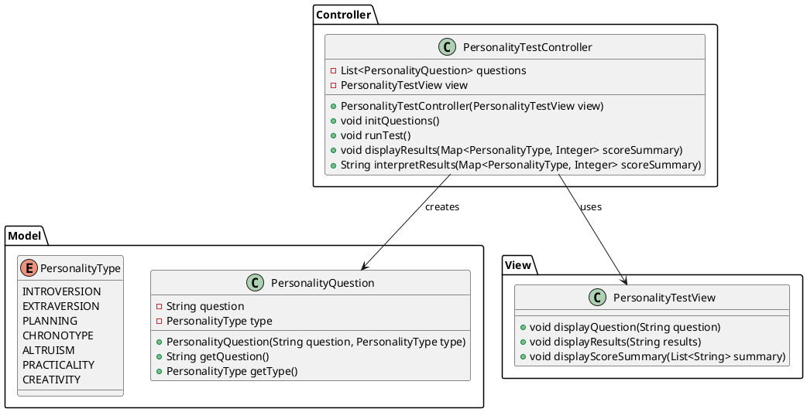
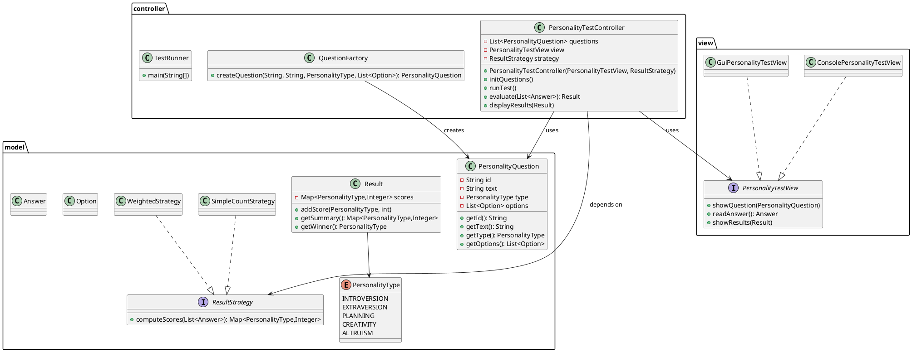

1er essaie

deuxieme essaie 
1. Vue d'ensemble
L'application suit l'architecture MVC :
- model : données et logique métier
- view : interface utilisateur (console / GUI)
- controller : orchestration, injection de dépendances

Principes SOLID : application concrète

- SRP (Single Responsibility)
  - PersonalityQuestion : conteneur de données et uniquement d’accès aux données.
  - Result / ResultStrategy : responsabilité unique de calcul et d’interprétation des scores.
  - PersonalityTestController : orchestration (récupère les réponses, appelle la stratégie, demande à la vue d’afficher).

- OCP (Open/Closed)
  - Nouvelles stratégies de calcul (nouvelle classe implémentant ResultStrategy) s’ajoutent sans modifier le contrôleur.
  - Nouvelles vues (ex. GUI) implémentent PersonalityTestView et se branchent sans toucher au reste.

- LSP (Liskov Substitution)
  - Toute vue implémentant PersonalityTestView peut remplacer la vue actuelle sans changer le comportement attendu.
  - Toute implémentation de ResultStrategy respecte le contrat computeScores().

- ISP (Interface Segregation)
  - PersonalityTestView propose uniquement les méthodes nécessaires à l’UI. Les vues spécifiques ajoutent leurs propres méthodes si besoin.

- DIP (Dependency Inversion)
  - Le contrôleur dépend d’abstractions (PersonalityTestView, ResultStrategy) et non d’implémentations concrètes. Les dépendances sont injectées (constructeur ou injection DI).

Exemples concrets dans le code :
- PersonalityTestController(PersonalityTestView view, ResultStrategy strategy)
- QuestionFactory.createQuestion(...) : création isolée

---

Design Patterns implémentés et justification

1. Factory (QuestionFactory)
   - Pourquoi : centraliser la création d’objets Question (complexes : options, poids, id). Facilite tests et modifications de la création.
   - Où : QuestionFactory.createQuestion(...)

2. Strategy (ResultStrategy + implémentations SimpleCountStrategy, WeightedStrategy)
   - Pourquoi : différentes logiques d’interprétation des réponses (comptage simple vs. pondéré) doivent être interchangeables sans modifier le contrôleur.
   - Où : injecté dans PersonalityTestController ; méthode computeScores(answers)

Évolutions possibles :
- Observer : pour notifier UI lorsque la progression change (utile pour GUI).
- Command : pour enregistrer actions de l’utilisateur et supporter annulation/replay.
